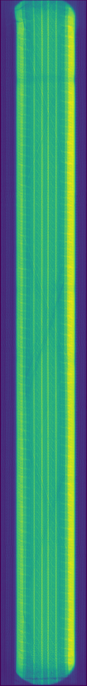

# Tire Defect Detection System Image Pre-Processing.
### I) What is Tire Defect Detection System?
TDDS is an AI-powered system which takes an X-ray video of a sample tire 
and outputs a float number between 0 and 1.0 indicating the defect precentage
of the sample tire.
### II) What does the image pre-processing system do?
The CNN used to obtain the defect percentage cannot process the raw input video because of two reasons :  
   1) The size of the video is too much and hence can not be processed in real-time. In fact it could take months to even train such a model.
   2) There is large amount of repeated and redundant pixels in tandem frames especially if the input video is captured with a high FPS. 

Thus, it is neither logical nor optimal to use the video as input.

### III) Example of Pre-Processing:
Input :   

 
output : 
